<h1 align="center">Afghanspere</h1> 

 The Afghansphere project aims to be a vibrant platform that not only showcases Afghanistan's natural beauty and historical significance but also serves as a community-driven space for sharing personal experiences and cultural pride. By engaging both locals and visitors, the project can promote a deeper understanding and appreciation of Afghanistan's unique heritage. [Deployed Link](https://afghansphere-4d07ea9a1a6f.herokuapp.com/)

  <!-- I AM Responsive image -->
  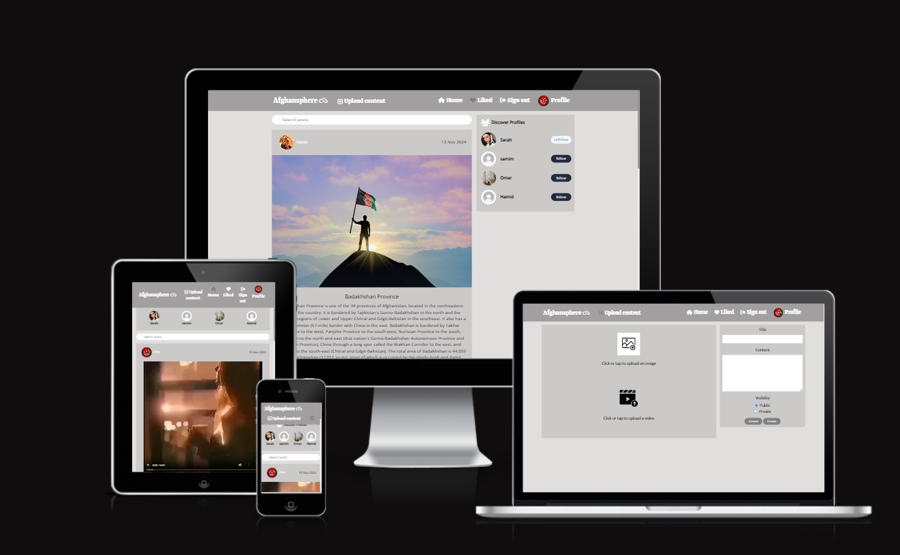

# B. The Afghansphere Front-end Documentation

##  User Experience
### _Project Objective:_

The primary objective of Afghansphere is to create a focused and dynamic platform that enables Afghan enthusiasts to connect, share, and engage around the core activities of post sharing and community interaction. This platform aims to provide a tailored and immersive experience for users, promoting collaboration, knowledge sharing, and community building.

Here’s the revised text for **Afghansphere**:  

### _Site User's Goal:_  
Users of Afghansphere seek to achieve the following goals:

1. **Content Sharing**: Share pictures and videos related to Afghan culture, experiences, and insights to contribute to the community's collective storytelling.
2. **Engagement**: Like, comment, and interact with posts to foster meaningful conversations and connections within the community.
3. **User Profile Management**: Maintain a comprehensive user profile that showcases personal interests and contributions to Afghansphere.
4. **Stay Informed**: Keep up-to-date with the latest content shared by others in the Afghansphere community.

### _Site Owners' Goals:_

The site owners aim to achieve the following objectives:

1. **User Engagement**: Encourage active participation, interactions, and content sharing among users to create a vibrant and dynamic community.
2. **User Growth**: Attract new users to the platform and retain existing members, ensuring a steady increase in the user base for ongoing engagement.
3. **Quality Content**: Maintain high-quality posts and comments by moderating contributions to promote valuable and relevant content.
4. **Community Interaction**: Foster meaningful discussions and connections through likes and comments on shared pictures and videos.
5. **Platform Sustainability**: Ensure the long-term viability and relevance of the app within the Afghan community.

By focusing on core features like post sharing and user interaction, Afghansphere can provide a specialized and valuable experience for its users while meeting the goals of the site owners.

## Project Management

### _GitHub Project Board_
Throughout my project management journey, I have leveraged the powerful features of GitHub Project Boards to effectively organize and enhance my latest initiative. It all started with a surge of creativity inspired by my carefully designed wireframe models. These models laid the groundwork for a series of detailed user stories, each acting as a vital component in bringing my project to fruition.

User stories go beyond mere descriptions; they offer a clear and logical framework for development, ensuring that the final product aligns closely with my vision. This intentional strategy helps maintain order and facilitates timely progress.

To reinforce this structure, I established milestones, particularly focusing on the frontend application. Milestones serve as crucial checkpoints, enabling me to monitor the project's progress in manageable segments.

What makes this process even more intriguing is my use of the MoSCo method to prioritize features and issues, categorizing them into Must-haves, Should-haves, Could-haves, and Won't-haves. This method acts as my strategic advantage, allowing me to make informed decisions and ensuring that essential elements are addressed before exploring finer details, thereby enhancing efficiency.

Ensuring quality is also a priority. I have carefully documented acceptance criteria for each user story, which serve as clear benchmarks for completion, eliminating ambiguity and guaranteeing that every aspect of the project meets my high standards.

To unify these efforts, I have broken each user story down into a series of detailed tasks that are intricately linked to the overall narrative. These tasks act as practical building blocks for execution, providing a clear roadmap for my dedicated development team. They help maintain the structure of the workflow while allowing for an effective division of labor. 
### Note: The issues created for the Pythonista app are available in [this repository](https://github.com/users/LimaZurmati/projects/16). I have linked these issues to a separate React repository specifically focused on front-end development.


## Agile Development Methodology

An agile development approach was documented and tracked using GitHub issues and projects. Each user story was represented as a GitHub issue, labeled to indicate its necessity for the MVP. A GitHub milestone was established to serve as the product backlog, where all user stories were initially listed.

Development was organized into a series of iterations, each with a timebox of three working days, totaling 17 story points. The actual duration of each iteration varied in calendar days due to the need to accommodate work and other commitments.

A GitHub project board was created for each iteration, allowing user stories to be moved from the product backlog into the relevant iteration at the start of each work cycle. User stories were categorized with labels indicating whether they were 'must have', 'could have', or 'should have' for that iteration, along with assigned story point values. Story points for 'must have' user stories were capped at 9 (60%). Some iterations included additional 'tasks' for activities not represented as user stories, such as setup/configuration and design/styling.

A project kanban board was utilized to monitor progress, with user stories transitioning between the 'Todo', 'In Progress', and 'Done' columns as appropriate. For instance, the iteration 2 project board was documented at the beginning, midpoint, and conclusion.
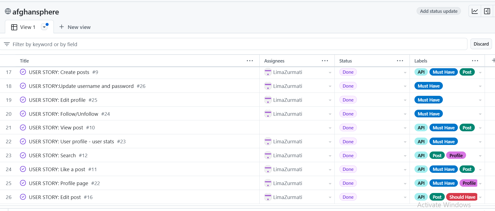
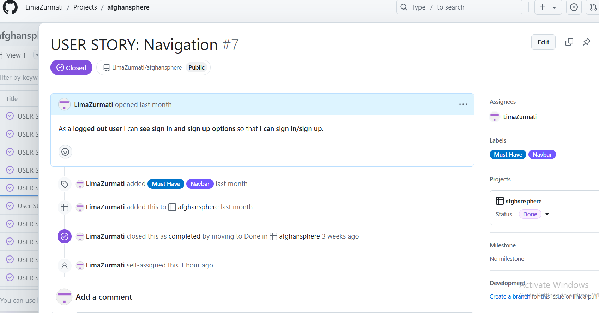 [User story project](https://github.com/LimaZurmati/afghansphere)

### _User Stories_

1. As a User, I can access the navigation bar across the site, allowing me to easily move between pages from any location.
2. As a User, I can sign into the app to unlock the full functionality of the site.
3. As a User, I can sign out of the app to halt access to full features when I'm not actively participating.
4. As a User, I can view other users' profile pictures to easily recognize them within the application.
5. As a User, I can create posts to share my experiences with the community.
6. As a User, I can view the details of a single post to gain more insights.
7. As a logged-in User, I can like a post to express my support for content that resonates with me.
8. As a User, I can search for posts, events, and profiles using keywords to find the content and users that interest me most.
9. As a User, I can see a comprehensive list of all posts shared on the site.
10. As a logged-in User, I can edit my own posts to update information or correct errors.
11. As a logged-in User, I can create comments to engage with the community.
12. As a logged-in User, I can edit my comments to modify or improve my existing content.
13. As a logged-in User, I can delete my comments when I choose to remove them.
14. As a User, I can view another user's profile page to explore more details about them.
15. As a User, I can update my profile information to keep it current.
16. As a logged-in User, I can follow and unfollow other users, making it easy to manage my follower list.
17. As a User, I can discover additional profiles to find more individuals to follow.

## Design

### Colours
The primary design goal for the Afghansphere app was to achieve a clean and functional aesthetic. The DaisyUI component library was selected for its straightforward color theming feature, enabling the developer to create multiple color themes with a limited palette and semantic class names. This approach aligns perfectly with the desire for a simple and uncluttered user interface.

The colour palette is made up of following colours:
 * rgb(204, 201, 201); - content background-color
 * black - boreder
 * #ffffff - a
 * #2142b2 - a:hover
 * #555 - background
 * rgb(225, 222, 222) - App background

### _Typography_
I used two google fonts for pythonista:
 * **'Open Sans', sans-serif;'** - Sit content

 ## Features


### _Existing Features_
**Navigation Bar**


The navigation bar includes various clickable links, allowing the user to easily access the pages on the app. The links change according to whether the user is signed in or out, giving them access to more content once signed in.
The links on the navbar are:

* Afghanspere Logo
* Home
* upload Post
* Liked
* User Action (displayed as dropdown menu )
    * Profile
    * Sign Out
* Sign Up
* Sign In

To enhance user navigation, the navigation bar is fixed at the top of the page, remaining visible as users scroll down.

* 
The navigation bar maintains a consistent appearance across all pages, ensuring a uniform experience throughout the app.

A hover effect is included, causing the icons to change to a turquoise color and the cursor to turn into a pointer when hovering over both the text and icons, indicating that they are clickable.

React Bootstrap was utilized to build the navigation bar, ensuring it is fully responsive on all devices.
* **Navbar When users are not loggedIn**

    

* **Navbar in Mobile's Screen**

    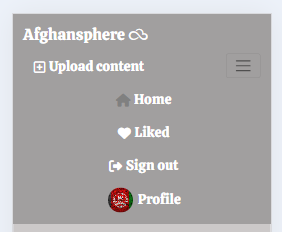

* **Navbar in Tablet's Screen**

    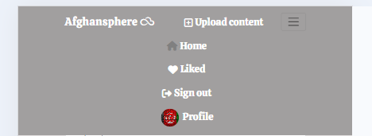

Home Page 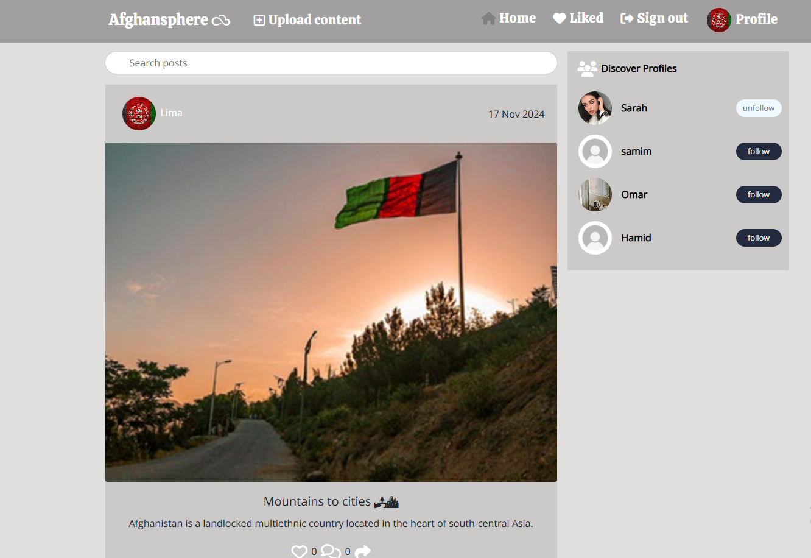 The homepage serves as the initial point of access for users, featuring user posts, a post search function, and options to discover profiles. Each post displays the user's username and profile image, along with the posting date, content, and details of user interactions, such as likes and comment counts.    

* **Post Page**

    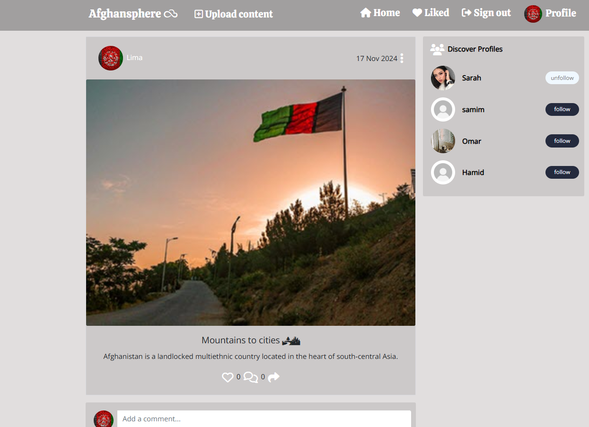

    The post page contains further information on the post in question, as well as the homepage version of the post.

    The features here are:

    * Ability to create a comment if logged in.
    * Ability to edit or delete post if you are the owner of the post.
* **Create Post Form**

  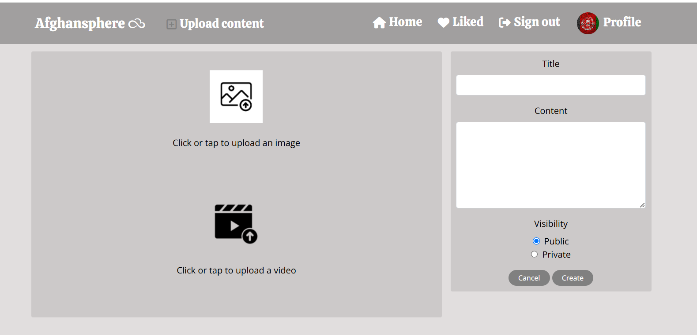  
  Logged-in users can share new posts with the community. By clicking the Create Post icon in the navigation bar, they are directed to the page for submitting a new post, where they can fill out the post creation form to send to the API.

* **Post Edit Form**

  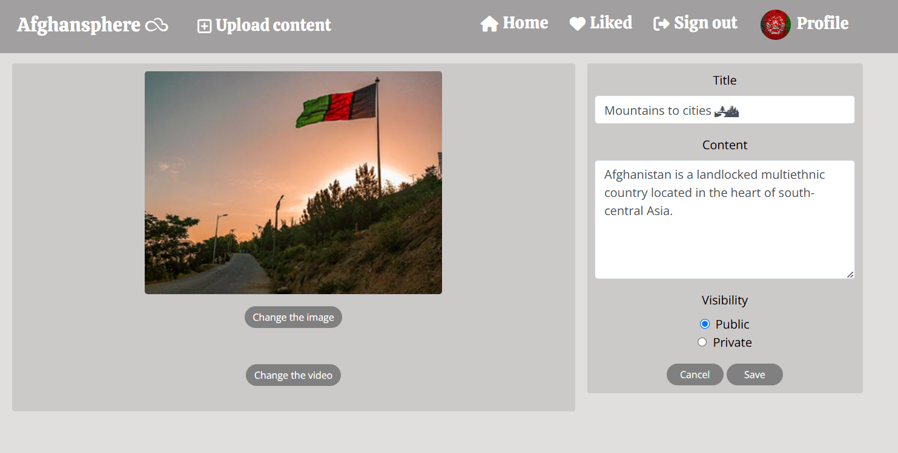 
  When users click on a post, they are taken to the post page. By selecting the "3 dot" button next to the post date, they can access the edit post feature. Clicking "edit" brings up the post creation form, pre-filled with the existing post information. Users can modify the desired fields and save their changes, which will redirect them to the post detail page, confirming that the post has been successfully updated.    
  
Profile Page 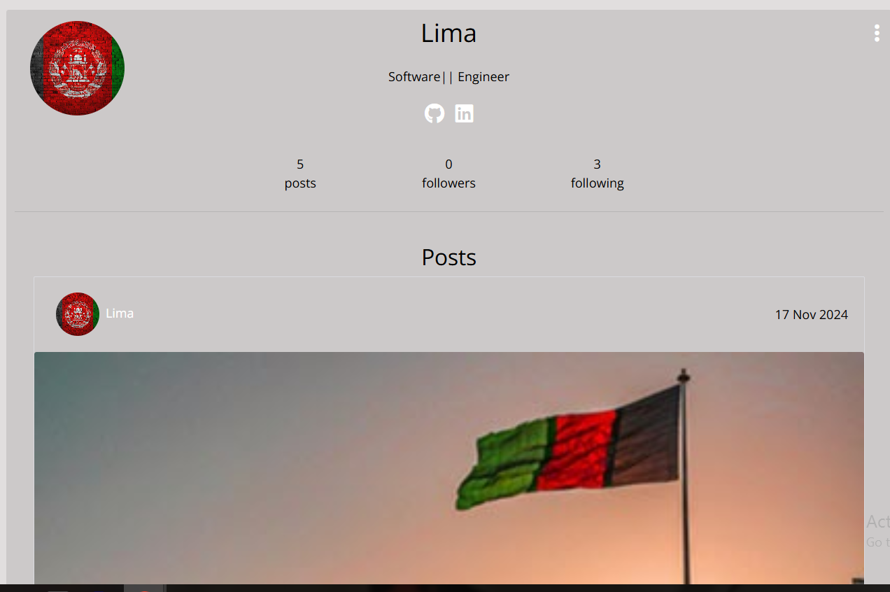
The profile page displays the selected user's information—either your own via the navigation bar or another user’s by clicking their profile image. It includes the user’s username, profile image, bio, social media links, and statistics such as followers, posts, and events. Additionally, it shows any posts or events created by the user. The only information that gets updated on the profile page includes:
The number of posts the user has published
The number of profiles they are following
The number of profiles that follow them

Edit Profile Page 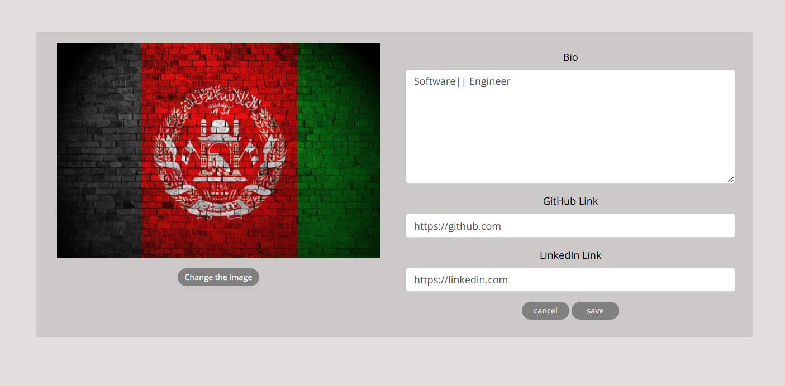
By selecting the Edit Profile option, users are taken to a new page with a complete profile details form to fill out and submit. Here, they can upload their avatar image, write a bio, and include links to their GitHub and LinkedIn. Once these fields are completed, they will be visible to other users in the main profile page stats section. Any entered website links can be clicked to open in a new browser tab. Each profile also features a follow button within the stats section, allowing other users to follow or unfollow as needed, since not all profiles are displayed in the popular profiles component.

* **SignUp Page**

    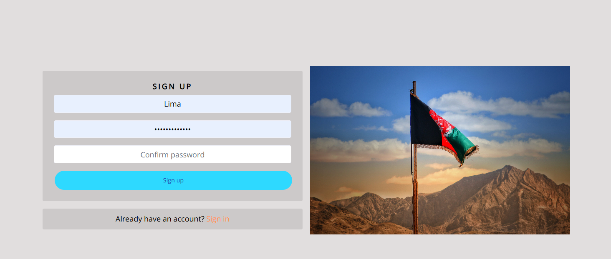

    The sign up page is only accessible if the user is logged out. This page consists of a form to be completed in order to sign up and create an account, and a link to the sign in page if the user already has an account.

* **SignIn Page**

    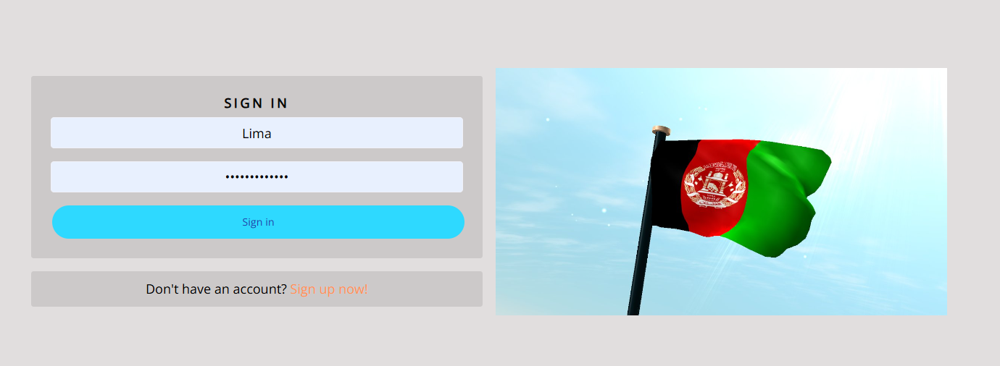

    The sign in page is only accessible if the user is logged out. This page consists of a form to be completed in order to sign in, and a link to the sign up page if the user does not yet have an account.


### _Future Implementations_

If there was time after my gratuation I'd like to implement these feature in Pythonista appp and make it more powerfull.

* **Notification System:**
Allow users to recive notification when someone leave a comment on her/his post, event post or add reaction on a post.

* **Messaging System:**
A chat functionality, allowing users to send each other messages, and thus to create stronger connections between like-minded people.
Seeing which users are online including links to the chat page, enabling users to have real-time conversations.

## Design

### _Mock-Up_

* **Home Page**
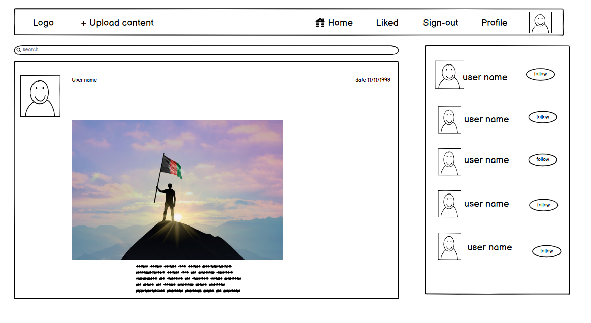

* **Create Post Page**
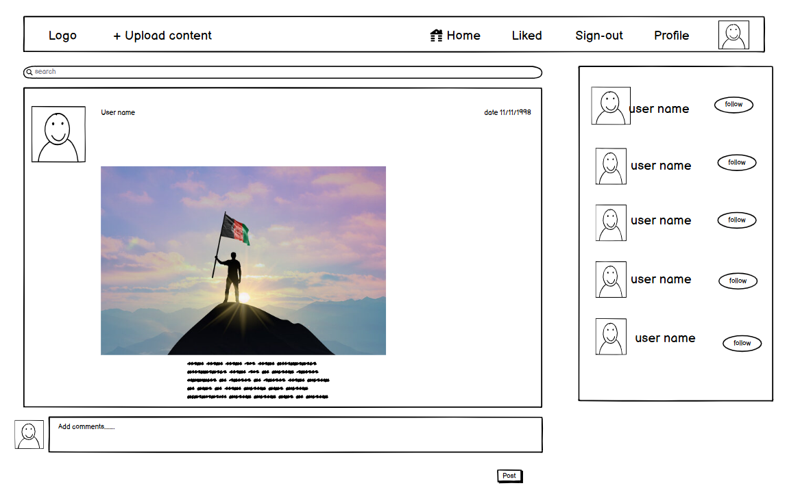

* **Upload Post Page**
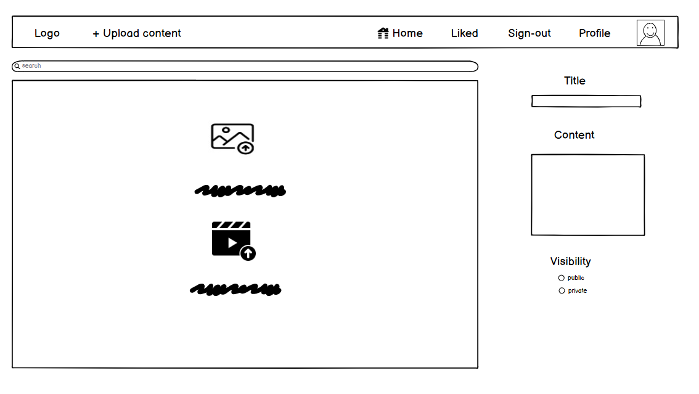

* **Profile**
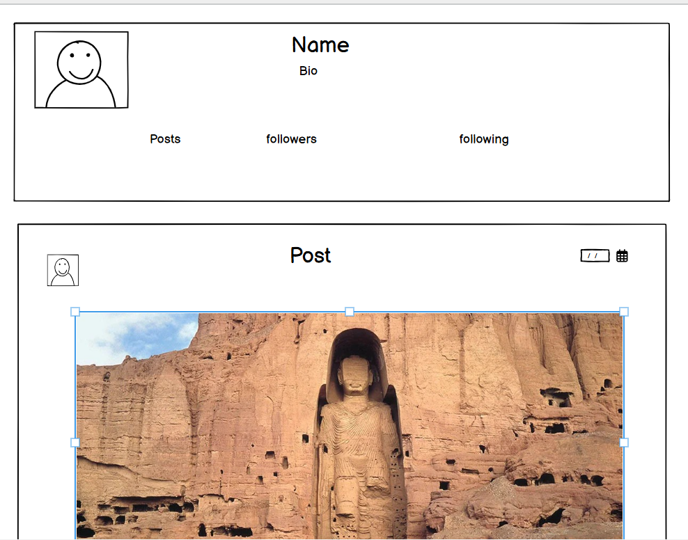

* **Sign UpPage**
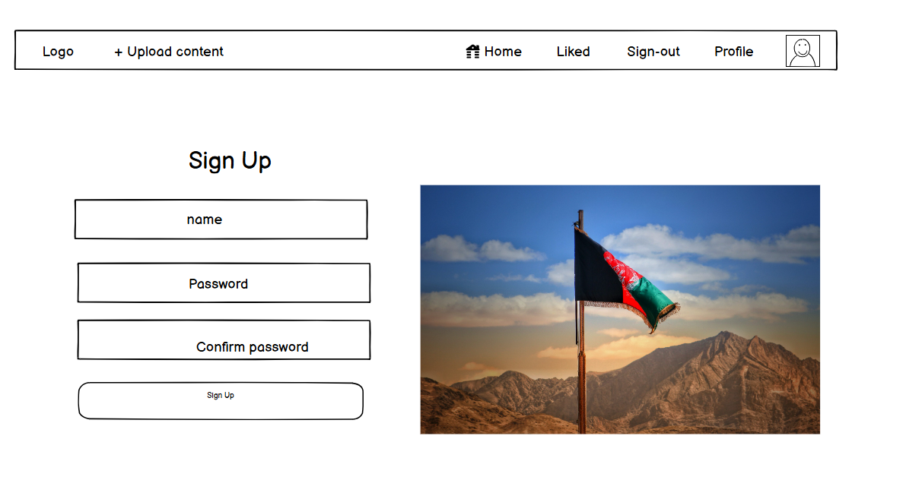

* **Sign In Page**
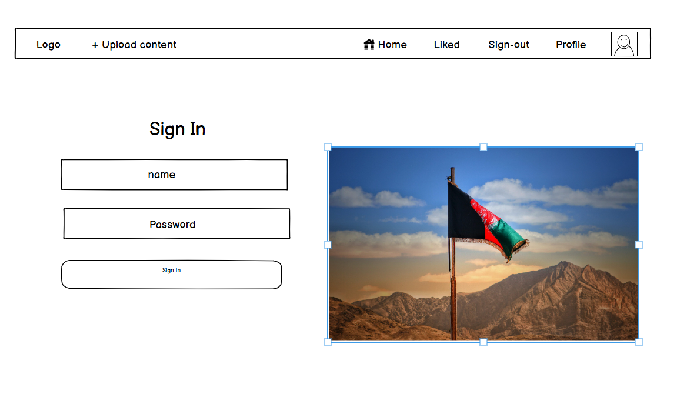


## Testing  Part [testing.md](/testing.md) 


## Bugs

### _Solved Bugs_
In the Afghanspherere app, users are experiencing an issue where newly created profiles do not appear on the posts page. This is a critical functionality as it affects user engagement and the visibility of content within the community.
it was, because of page-size in stting.py

### _UnSolved Bugs_
No bugs so far.


## Technologies Used

### _Languages_

* **HTML5** - Provides the content and structure for the website.
* **CSS3** - Provides the styling for the website.
* **JavaScript** - Provides interactive elements of the website.
* **React.js** - Provides the base for the frontend components.

### _Frameworks, Libraries & Programs_

* **React -** React was used to create this web app.
* **React Bootstrap -** React Bootstrap was used to create this web app and to make it fully responsive.
* **Git -** Git was used for version control by utilizing the Gitpod terminal to commit to Git and Push to GitHub.
* **GitHub -** GitHub is used to store the projects code after being pushed from Git.
* **GitHub Projects -** GitHub Projects was used to create the User Stories.
* **Heroku -** Heroku was used for the deployed application.
* **Chrome DevTools -** Chrome DevTools was used to consistently check the site in terms of responsivity, performance, accessibility, best practice and SEO.
* **Cloudinary -** A service that hosts image files in the project.
* **React Router -** React library for rendering components in the DOM.
* **Axios -** To tell the React project to send requests to the API.
* **React Infinite Scroll Component -** For implementing infinite scrolling.
* **Jwt-Decode -** Securely implement authentication with JSON Web Tokens.
* **Pillow -** Adds image processing capabilities to your Python interpreter.
* **React Notifications -** Library for displaying notifications.
* **React Testing Library**

## Deployment


### Steps Before Beployment 

1. Run npm audit fix in the frontend to fix API errors and feedback
2. collect the admin and DRF staticfiles with the followin command in the terminal:
```
  python3 manage.py collectstatic
```
3. compile the React application and move its files to the staticfiles folder. In the terminal, cd into the frontend directory typing:
```
cd frontend
```
4. Run the command to compile and move the React files:
```
  npm run build && mv build ../staticfiles/.
```
**Note:** We need to re-run this command any time you want to deploy changes to the static files in your project, including the React code. To do this, you need to delete the existing build folder and rebuild it. This command will delete the old folder and replace it with the new one:
```
  npm run build && rm -rf ../staticfiles/build && mv build ../staticfiles/.
```
5. Create a new file in the root directory named runtime.txt
6. Inside the runtime.txt, add the following line: `python-3.9.16`
7. In the `env.py` file, ensure that both the `DEBUG` and `DEV` enviroment varibles are comment out.

8. Run the Django server, in the terminal type: python3 manage.py runserver, then open the preview on `port 8000` to check that your application is runnig. The React server should be not be running. This is a test to check that Django is serving the React static files.

9. Commit and push the changes.

### _Heroku_

1. In your heroku account, select Create New App, and give it a unique name related to your project.
2. Select a region corresponding to where you live and click `Create App`.
3. Head into the `Deploy` tab select GitHub as the `deployment method`, find your project repository and click `Connect`.
4. Click `Deploy branch` to trigger Heroku to start building the application.
5. Once you see the message saying 'build succeeded' you can click `Open App` to see your application in the browser.


## Credits

1. The **Code Institute moments** walkthrough project both backend and frontend was a big guide.
2. The Upload image on the create event, and create post taken from **pngtree.com**
3. [React documentation](https://react.dev/reference/react)
4. [React Router Documentation](https://v5.reactrouter.com/) 
5. The Upload image is from socil media.
6. support and asstnace of Roman in salck also students support team specialy Oisin that assist me with patient.
7. [for mockup design](https://balsamiq.cloud) 

## Note
While I was running the workspace, I executed the following command at the beginning: nvm install 16 && nvm use 16.