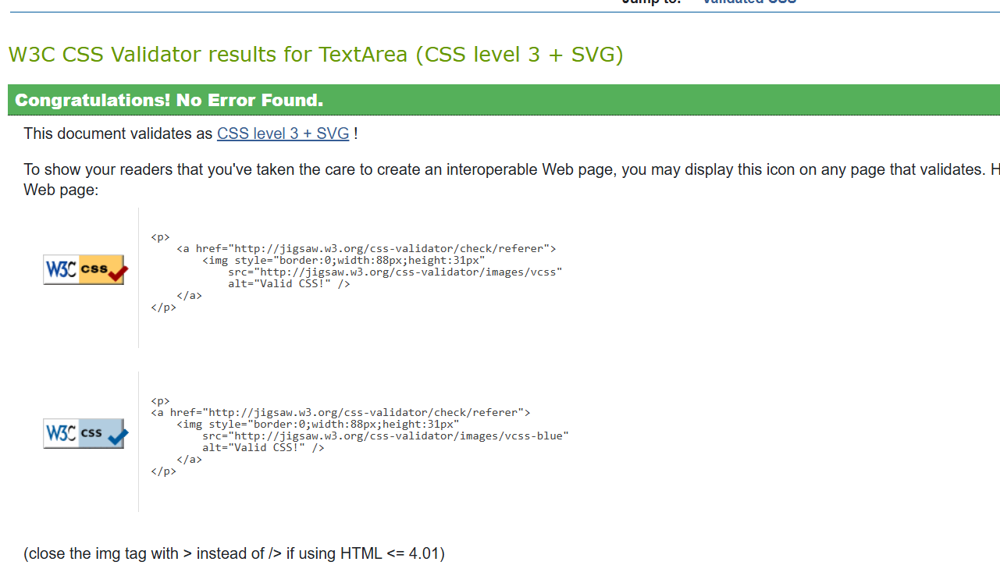
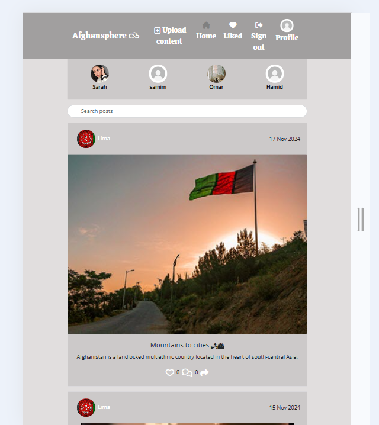
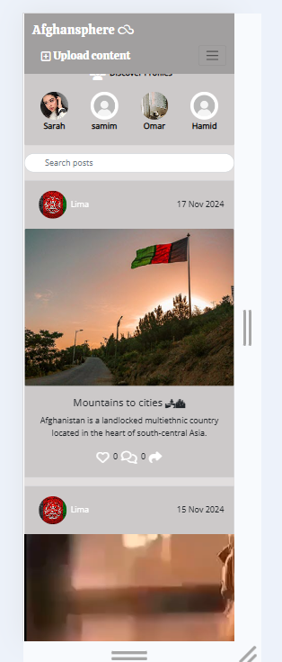
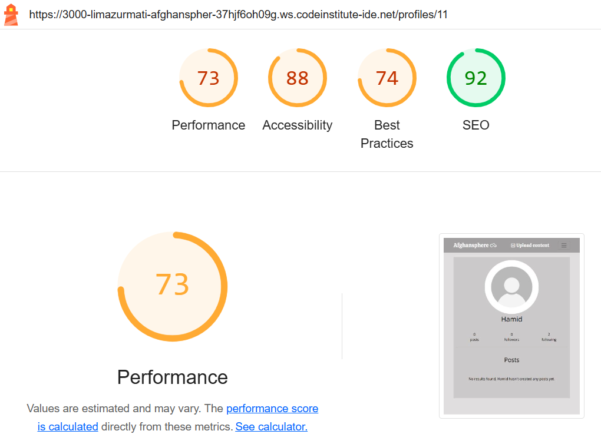

## Testing part
### _Code Validation_
The Afghansphere site has been passed through the W3C CSS Validator .

* **W3C CSS Validation Results:**
 No errors or warnings were found when the code was passed through the W3C CSS Validation checker.
  
  

Here's an updated version of your manual testing documentation tailored for an AfghanSPere app:

---

## MANUAL TESTING

### Authentication - User Logged Out

| Goals | How are they achieved? | Expected Outcome | Result | Pass/Fail |
| :--- | :--- | :--- | :--- | :--- |
| Users cannot access restricted URLs. | Attempting to access Create Post, Edit Post, or Edit Profile pages. | Users are redirected to the Home page. | Successfully redirected. | Pass |
| Users can view the Sign In/Sign Up page appropriately. | Desktop users see an image; mobile/tablet users do not. | Image visibility is correct based on device. | Verified on multiple devices. | Pass |
| Navigation restrictions for logged-out users. | Attempting to access Profile and Sign Out links. | Links are inaccessible for logged-out users. | Access denied. | Pass |

### Post Component - Logged In

| Goals | How are they achieved? | Expected Outcome | Result | Pass/Fail |
| :--- | :--- | :--- | :--- | :--- |
| Users can create a post. | User follows the post creation workflow. | Post is created successfully. | Post created. | Pass |
| Users can upload an image. | User selects an image file during post creation. | Image is uploaded without issues. | Image uploaded. | Pass |
| Users can change the uploaded image. | User selects a new image file. | New image replaces the old one. | Image changed. | Pass |
| Users can upload a video. | User selects a video file during post creation. | Video is uploaded successfully. | Video uploaded. | Pass |
| Users can select post visibility. | User chooses between public or private visibility settings before posting. | Post visibility is set accordingly. | Visibility set correctly. | Pass |
| Users can like a post. | User clicks the like button on a post. | Like count increases. | Like confirmed. | Pass |
| Users can leave a comment. | User submits a comment on a post. | Comment is displayed under the post. | Comment posted. | Pass |
| Users can edit/delete their own posts. | User selects edit/delete option on their post. | Post is edited or deleted as requested. | Edit/Delete successful. | Pass |

### Profiles - Logged In

| Goals | How are they achieved? | Expected Outcome | Result | Pass/Fail |
| :--- | :--- | :--- | :--- | :--- |
| Users can view other users' profiles. | User clicks on another user's avatar. | Profile page opens correctly. | Profile displayed. | Pass |
| Users can edit their own profiles. | User accesses the edit profile option. | Profile form is editable. | Edit successful. | Pass |
| Users can change their username. | User enters a new username in the profile edit form. | Username updates successfully. | Username changed. | Pass |
| Users can set a new password. | User inputs a new password in the settings. | Password updates without issues. | Password changed. | Pass |

### Following/Unfollowing - Logged In

| Goals | How are they achieved? | Expected Outcome | Result | Pass/Fail |
| :--- | :--- | :--- | :--- | :--- |
| Users can follow other users. | User clicks the follow button on another user's profile. | Follow count increases. | Follow confirmed. | Pass |
| Users can unfollow other users. | User clicks the unfollow button. | Follow count decreases. | Unfollow confirmed. | Pass |

### Further Testing Scenarios

| Goals | How are they achieved? | Expected Outcome | Result | Pass/Fail |
| :--- | :--- | :--- | :--- | :--- |
| Error handling for user actions. | Testing various actions that may fail. | Relevant error messages appear for failures. | Errors displayed correctly. | Pass |
| Responsiveness across devices. | Accessing the app on various devices. | Components adapt smoothly. | Verified on multiple screen sizes. | Pass |
| Accessibility compliance. | Testing keyboard navigation and screen reader support. | App meets accessibility standards. | Compliance verified. | Pass |
| Performance assessment. | Monitoring loading times during peak usage. | Loading times are within acceptable limits. | Performance satisfactory. | Pass |

### _Responsiveness Testing_
The responsive design tests were carried out manually throughout the build using [https://ui.dev/amiresponsive]. I based the main design around a desktop view, as this is primarily a browser based platform, although I have added responsive design for tablet and mobile devices as well.

Here are the results:

*  _Desktop View_
    

*  _Tablet View_
    

*  _Mobile View_

    

### _Lighthouse Testing_
Google Lighthouse in Chrome Developer Tools was used to test the application within the areas of Performance, Accessibility, Best Practices and SEO.

